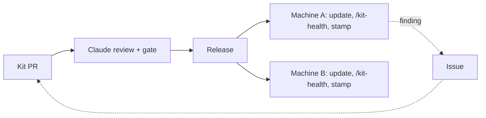

# bAIton

**`ai-baton` — a workspace kit for Claude Code: every session gets the same skills, rules and memory,
hands off to the next, and every machine checks and updates its own copy.**

[](https://github.com/MdaaaaO/ai-baton/actions/workflows/ci.yml)
[](https://github.com/MdaaaaO/ai-baton/releases)
[](https://www.conventionalcommits.org)
[](docs/packaging.md)

Install it as a plugin or clone it. You get skills for PRs, tickets, sessions and docs, a markdown database for
what sessions learn, and one store for per-machine values. No names, ids or org settings: every machine and
teammate uses it unchanged.

**Plugin**: Claude Code installs and updates it.

```sh
claude plugin marketplace add MdaaaaO/ai-baton && claude plugin install ai-baton@ai-baton-kit
cd ~/Projects && claude    # start Claude Code in your workspace root (the directory that holds your repos), then:
/kit-setup                 # runs the kit's setup.sh here; restart Claude Code, then in the first session:
/kit-health
```

**Clone**: the whole workspace kit, with the git hooks, the `make` targets and the fast-forward sync.

```sh
cd ~/Projects      # your workspace root: the directory that holds your repos
git clone https://github.com/MdaaaaO/ai-baton.git .claude && sh .claude/setup.sh --personal
# restart Claude Code, then in the first session:
/kit-health
```

> **Never use your home directory as the workspace root.** `~/.claude` is Claude Code's own config directory;
> `setup.sh` refuses `$HOME` as the workspace root.

Both paths set `$BATON`, the environment variable naming the kit root that the rest of this repo's docs and
commands write as `$BATON/…` — a clone's `settings.json` sets it to `.claude`, a plugin install's SessionStart
hook exports it from Claude Code's plugin cache. You never set it yourself (`docs/glossary.md`).

## Why a kit

| You have | What breaks | What the kit adds |
|---|---|---|
| A `CLAUDE.md` in each repo | Rules drift from repo to repo. Nothing is shared across repos. | One `WORKSPACE.md` that every session loads (a `CLAUDE.md` import on a clone, a SessionStart hook on a plugin) |
| A skills plugin | Skills hardcode your org, channels and ids, or ask you for them every time | An env fact store: a fact is found once, then read everywhere |
| Nothing | Each session starts cold and forgets what the last one learned | `.context/`, an indexed markdown DB, plus a session registry and handoff docs |

Use a plain `CLAUDE.md` when you have one repo and work alone. The kit pays off once you have several repos,
several machines or several people.

## How it works

1. Every session loads `WORKSPACE.md` (the shared rules): a clone's root `CLAUDE.md` imports `.claude/WORKSPACE.md`,
   a plugin's SessionStart hook injects it. The root `CLAUDE.md` also imports `.context/reference/environment.md`
   (your environment's prose).
2. Only the skills' names and descriptions load into a session. A skill's body loads when it runs.
3. A skill that needs a value, such as a channel id, reads it from the env store in `.context/reference/env/`. It
   discovers a missing value once and writes it back.
4. What sessions learn goes into `.context/` as rows of a markdown DB with a generated index.
5. Sessions register in a live registry and hand off through one context doc per initiative.
6. Kit changes are PR-only. Each machine picks them up itself: a clone runs `make claude_sync` (its SessionEnd hook
   does too) to fast-forward to the merged `main`, a plugin install updates to each release with `claude plugin update`.

## Stays healthy on every machine

The kit maintains itself, and each machine that runs it checks its own copy:

| Loop | What it does |
|---|---|
| `/kit-health` | Audits the kit and this machine's wiring (frontmatter, leaked values, env store, hooks, an engine smoke), names the update command when a newer release is out, and stamps `.context/kit-health/HEALTH-<env>.md` |
| Versioned units | Every skill and agent carries a version; each PR says what a machine must do, usually nothing, and the release log is generated |
| Updates | A clone fast-forwards itself at session end, a plugin install updates per release, and each machine re-stamps on its own |
| Many sessions | A live registry with heartbeats, one PR watcher per repo and a handoff prompt per session, so parallel and successor sessions pick up in-flight work |
| The kit's own PRs | Claude reviews every PR, a gate blocks leaked values and missing version bumps, and auto-merge lands it on green |



## Install

| Path | Prerequisites |
|---|---|
| Both | [Claude Code](https://claude.com/claude-code), `python3` and `make`. `gh` logged in lets `--personal` fill your identity and runs the PR and ticket skills |
| Clone | `git` as well |

[`docs/packaging.md`](docs/packaging.md) compares the two paths.

### Quick start: a GitHub-only machine

This setup needs no questions. Run the block for your path above, from your workspace root. `--personal` takes
your login and name from `gh`, your repos from the clones under the workspace root, and the timezone from the OS.
It sets every `systems.*` flag to false. A skill that needs Jira, Slack or a warehouse stops with one "not
applicable here" line. It is safe to re-run.

On the plugin path `/kit-setup` runs the plugin's own `setup.sh` from inside the session, which knows where the
plugin lives (its root moves on every update). That seeds `.context/` and the root `CLAUDE.md`, but no `Makefile` include:
the plugin's own hook loads the shared rules. To set your identity without `gh`, run `/plugin configure ai-baton`.
[`docs/plugin-setup.md`](docs/plugin-setup.md) walks the plugin path step by step, including updates and a switch
from a clone.

### Full path: a tracker, chat or warehouse

This is a clone path. Paste the install prompt from [`docs/new-environment.md`](docs/new-environment.md) into
Claude Code. It clones the kit into `.claude/`, asks once for your identity and the structural switches, then runs
the same `setup.sh`.

### Keep it current

| Path | Update, then restart Claude Code and run `/kit-health` to re-stamp the machine |
|---|---|
| Plugin | `claude plugin marketplace update ai-baton-kit && claude plugin update ai-baton@ai-baton-kit` |
| Clone | `make claude_sync` (or `sh .claude/sync.sh`). It only ever fast-forwards `main` |

`/kit-health` warns when a newer release is out and prints the update command. [`docs/sync.md`](docs/sync.md)
explains the clone's hooks and guards.

## What's inside

| Category | Skills |
|---|---|
| Sessions and knowledge | `session-register` · `session-handoff` · `session-retro` · `env-init` · `kit-setup` · `kit-health` · `cost-report` · `self-assessment` |
| Pull requests | `pr-open` · `pr-watch` · `pr-event-brief` · `pr-scan` · `pr-review` · `gh-cli` |
| Tracker | `ticket-open` · `ticket-update` · `ticket-close` |
| Docs | `repo-docs` |
| Needs a system (`systems.*`) | `sign-queue` · `signed-git-commits` · `slack-draft` · `alerts-sweep` · `aws-sso-login` · `dbt-sqlfluff-fixes` · `notion-page-review` |

It also ships three agents (`triage`, `review-runner`, `auto-runner`) and the `context-db/` engine
(`make -C $BATON/context-db help`). [`docs/skills.md`](docs/skills.md) describes each item in one line.

## Documentation

| Page | Read it for |
|---|---|
| [layout](docs/layout.md) | What every file and directory is |
| [conventions](docs/conventions.md) | The six rules that keep the kit portable |
| [architecture](docs/architecture.md) | One diagram: session → imports → skills → engine → context DB |
| [env-facts](docs/env-facts.md) | The env fact store, `kb.py`, and how a skill resolves a fact |
| [env-vars](docs/env-vars.md) | Every environment variable a kit script reads: default, reader, purpose |
| [new-environment](docs/new-environment.md) | Setting up a machine with a tracker, chat or warehouse |
| [plugin-setup](docs/plugin-setup.md) | The plugin install step by step, updating it, switching from a clone |
| [loading](docs/loading.md) | What loads when, and the byte budgets |
| [packaging](docs/packaging.md) | Plugin versus clone |
| [sync](docs/sync.md) | How the kit moves between machines |
| [authoring](docs/authoring.md) | The checklist for a new skill or agent |
| [delegation](docs/delegation.md) | When to hand a read or a fix to a subagent, sized by cost |
| [engine-cli](docs/engine-cli.md) | Every engine command and flag |
| [commit-style](docs/commit-style.md) · [REVIEW](docs/REVIEW.md) · [glossary](docs/glossary.md) · [CHANGELOG](CHANGELOG.md) · [contributing](docs/contributing.md) | Contributor reference |

## Contributing

Issues and PRs are welcome. [`CONTRIBUTING.md`](CONTRIBUTING.md) starts with the short version.

## License

[MIT](LICENSE).
