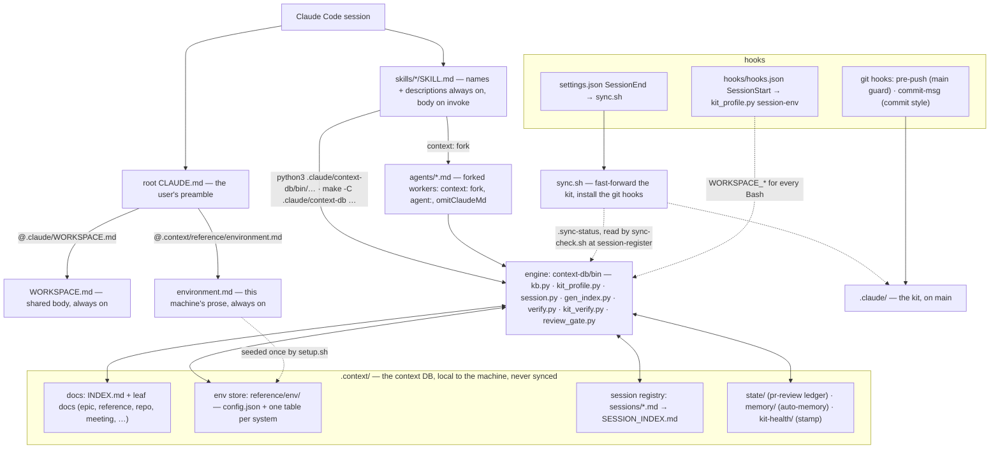

# Architecture — one picture

How a session reaches the kit, the engine and the context DB, and what writes back. Solid arrows are loads and
calls; dotted arrows are writes. Which of these load into every session and which only on demand is
`docs/loading.md`; the directory listing is `docs/layout.md`.

## Reading the picture

- **Session → root `CLAUDE.md`**: the one file the user owns; its two `@` imports pull in the shared body
  (`WORKSPACE.md`, from the kit) and the environment's prose (`.context/reference/environment.md`, seeded by
  `setup.sh` from `environment-template/environment.md`). Together with every unit's description this is the
  always-on layer.
- **Skills and agents**: Claude Code discovers `skills/*/SKILL.md` and `agents/*.md` (clone path) or the plugin's
  copies (`docs/packaging.md`). A skill body loads on invoke; a `context: fork` skill runs under the agent its
  `agent:` names (`triage`, `review-runner`, `auto-runner`) and returns a brief, never acts.
- **Engine**: every script under `context-db/bin/` (reference: `docs/engine-cli.md`) reads the environment through
  `kit_profile.py` and the env store through `kb.py`; `session.py` / `gen_sessions.py` keep the registry,
  `gen_index.py` / `verify.py` the catalog, `kit_verify.py` / `review_gate.py` / `review_evidence.py` the kit's own
  checks.
- **Context DB**: `.context/` beside the kit (or `CLAUDE_PROJECT_DIR/.context` on a plugin install, `CONTEXT_ROOT`
  to override). Its spec is `.context/README.md` (seeded from `context-db/context-README.template.md`); the env
  store's is `docs/env-facts.md`.
- **Hooks and sync**: `settings.json` runs `sync.sh` at `SessionEnd` (a fast-forward of `.claude/` to `origin/main`,
  never a commit); `hooks/hooks.json` re-exports plugin `userConfig` identity as `WORKSPACE_*` at `SessionStart`;
  `hooks/pre-push` and `hooks/commit-msg` are git hooks installed by `setup.sh` / `sync.sh` (`core.hooksPath`).
