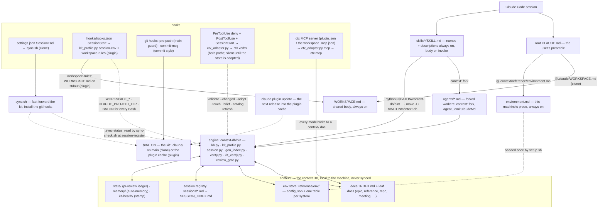

# Architecture — one picture

How a session reaches the kit, the engine and the context DB, and what writes back. Solid arrows are loads and
calls; dotted arrows are writes. Which of these load into every session and which only on demand is
`docs/loading.md`; the directory listing is `docs/layout.md`.

## Reading the picture

- **Session → root `CLAUDE.md` / SessionStart hook**: the root `CLAUDE.md` is the one file the user owns; it imports
  the environment's prose (`.context/reference/environment.md`, seeded by `setup.sh` from
  `environment-template/environment.md`). The shared body (`WORKSPACE.md`, from the kit) arrives by import or hook:
  on a clone the same file imports `@.claude/WORKSPACE.md`; on a plugin install there is no `.claude/WORKSPACE.md`,
  so the SessionStart hook prints it (`kit_profile.py workspace-rules`) and Claude Code adds that output to the
  session's context (`docs/packaging.md` § Installing). Together with every unit's description this is the
  always-on layer.
- **Skills and agents**: Claude Code discovers `skills/*/SKILL.md` and `agents/*.md` (clone path) or the plugin's
  copies (`docs/packaging.md`). A skill body loads on invoke; a `context: fork` skill runs under the agent its
  `agent:` names (`triage`, `review-runner`, `auto-runner`) and returns a brief, never acts.
- **Engine**: every script under `context-db/bin/` (reference: `docs/engine-cli.md`) reads the environment through
  `kit_profile.py` and the env store through `kb.py`; `session.py` / `gen_sessions.py` keep the registry,
  `gen_index.py` / `verify.py` the catalog, `kit_verify.py` / `review_gate.py` / `review_evidence.py` the kit's own
  checks.
- **Context DB**: `.context/` beside the kit (or `CLAUDE_PROJECT_DIR/.context` on a plugin install, `CONTEXT_ROOT`
  to override). Its spec is `.context/README.md` (seeded from `context-db/context-README.template.md`); the env
  store's is `docs/env-facts.md`.
- **Hooks and sync**: on a clone, `settings.json` runs `sync.sh` at `SessionEnd` (a fetch that holds a new release
  tag with a preview until `make claude_sync` fast-forwards `.claude/` to it, never a commit), and `hooks/pre-push` and `hooks/commit-msg` are git hooks installed by `setup.sh` /
  `sync.sh` (`core.hooksPath`). On a plugin install `hooks/hooks.json` runs at `SessionStart`: `session-env`
  re-exports plugin `userConfig` identity as `WORKSPACE_*`, plus `CLAUDE_PROJECT_DIR` and `BATON`, and
  `workspace-rules` injects `WORKSPACE.md`. On both paths the ctx-store adapter (`context-db/bin/ctx_adapter.py`) runs
  at `PreToolUse`, `PostToolUse` and `SessionStart`, a silent no-op until ctx-store is installed and a store is named
  (`docs/troubleshooting.md` § ctx-store hooks). After every context write the `PostToolUse` pass also commits and
  pushes a `.context/` that is its own git repository, and `SessionStart` pulls it (`context-db/bin/ctx_sync.py`,
  `docs/context-sync.md`).
- **Writes to the context DB go through ctx**: on an adopted store (`ctx_adapter.py adopt`, run once by `setup.sh`)
  the model writes a `.context/` doc with the ctx MCP server's tools (`ctx_str_replace`, `ctx_insert`, `ctx_log`,
  `ctx_fm`, `ctx_create`, `ctx_new`, `ctx_move`) — validated, locked and audited by ctx — and the `PreToolUse` hook
  denies a direct `Write`/`Edit` of one. The index's skip dirs (`sessions/`, `state/`, `memory/`, …) stay directly
  writable: `session.py` and the scripts own them. After every write the hooks touch the session's registry row and
  regenerate `INDEX.md` and `SESSION_INDEX.md`, so no skill runs `make index` as bookkeeping. The server is the
  plugin's `mcpServers` entry, or on a clone the workspace root's `.mcp.json` (`setup.sh` adds it,
  `settings.json` approves it); both start `ctx_adapter.py mcp`, which runs the pinned `ctx mcp` on the content root. A plugin install has no `sync.sh`: the kit moves with
  `claude plugin update` (`docs/sync.md`).
