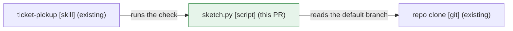

# Diagrams — the whiteboard defence contract

Owner decision, 2026-09-30 (#374): whatever a session writes about a change must let a cold reader draw it on a
whiteboard and defend it: where it sits, what it changes, how it runs, and why this shape won. This page is the
contract every surface follows. A skill links here and adds only its own step. The PR body's plan
(`diagram-plan.py`, its facets, exit codes and block rules) lives in
[`skills/pr-open/reference/diagrams.md`](../skills/pr-open/reference/diagrams.md), and this page does not repeat it.

**Status.** The scripts and status lines this page specifies are planned: each lands with the child issue named
against it in the zoom table's Owner column (#384 `sketch.py stamp`, #385 `sketch.py check`, #386
`diagram-plan.py --sketch`, …). Until a child lands, the surface it covers keeps its current behaviour; a tool or
line marked `(#<child>)` below does not exist on this head.

## The four questions

| Question | Answers | Form |
|---|---|---|
| WHERE | placement: the components or paths the change sits in, and what talks to them | Mermaid `flowchart`, or a nested list |
| WHAT | shape before → after: tables, fields, files, resources | table `x \| before \| after \| note` |
| RUNS | the flow when it executes | Mermaid `sequenceDiagram` or `flowchart`; PR and review only |
| WHY | the option that lost | options table, 2–4 rows |

The WHY table has one fixed shape. Exactly one row says `yes`, and each reason names the fact that decided it. When
there was no real alternative the table is left out; never add a strawman row to fill it.

| Option | Chosen | Reason |
|---|---|---|
| marker as an HTML comment | yes | invisible on GitHub and Jira, parsed by one regex, same shape as the plan marker |
| marker as a YAML block | no | every tracker renders it as visible text |

## Zoom and gate per surface

Zoom follows C4: a ticket shows the **target state** (context / container), a PR the **delta** (component / code),
the epic context doc the **living map** (container / component plus model lineage). SKIP is the default everywhere
except the PR, which keeps its own plan.

| Surface | Skill | Zoom | Gate | Draws | Script line | Owner |
|---|---|---|---|---|---|---|
| Ticket | `ticket-open` | target state | a Sketch only when the Sizing line says `opus`; else `Sketch: SKIP (<reason>)` | WHERE + WHAT target + WHY when an alternative existed | the sketch marker | #384 |
| Pickup | `ticket-pickup` | reads only | the ticket has a sketch marker | nothing | `SKETCH OK` / `MOVED <path>` | #385 |
| Pivot | `ticket-update` | before → after of the sketch | a marker exists **and** the pivot moved a placement or a shape | the redrawn Sketch with a new marker | the new marker supersedes the old | #385 |
| Close | `ticket-close` | as-built | the ticket has a sketch marker | nothing: names the PR's diagrams | `As-built: #<pr> — Sketch: matches \| differs (…)` | #385 |
| PR | `pr-open` | delta | the plan from `diagram-plan.py`, its SKIP included; WHY on feature PRs only | the planned blocks + WHY table | plan marker, `Sketch:` line (#386), `LINT` warnings | #386 |
| Watch | `pr-event-brief` | reads only | a HEAD MOVED event on the session's PR | nothing | `DIAGRAMS: OK \| DRIFT \| NO MARKER` | #388 |
| Review | `pr-review` | the PR's delta, read | a finding only above `deep_lines` or on a contract change | a ≤ 10-step `sequenceDiagram` in a flow STOP whose prose would need > 3 sentences | `WBD: covered \| gap <question>` | #387 |
| Epic doc | `_templates/epic.md` | living map | optional `## Architecture` section, absent from the store type's required list | WHERE map + model lineage, plain rendering | — | #389 |
| Handoff | `session-handoff` | living map | a PR landed since the last flush whose plan marker carries `WHERE=` | updates `## Architecture`, or logs one line why not | `Architecture unchanged: <reason>` | #389 |

The drawing brief, the kit's issue-template line and the cost measurement belong to #390.

## The exact lines

Where a script emits a line, the model adds only the text after `—`; it never edits the computed part.

| Line | Where | Emitted by |
|---|---|---|
| `Sketch: SKIP (<reason>)` | ticket, in place of the Sketch; the reason is the Sizing model plus a few words, e.g. `sonnet-sized, specified fix` | the model |
| `SKETCH OK` | pickup report: every placed path is still on the default branch | `sketch.py check` (#385) |
| `MOVED <path>` | pickup report, one line per entry gone from the default branch (sorted) | `sketch.py check` |
| `STALE SKETCH <old>→<new>` | pickup report: the drawing was edited after stamping (hash mismatch); restamp | `sketch.py check` |
| `MALFORMED SKETCH <line>` | pickup report: a `<!-- sketch:`-shaped line that does not parse | `sketch.py check` |
| `Sketch: matches` | PR body, directly under `## Diagrams`; repeated in the close comment | `diagram-plan.py --sketch` (#386) |
| `Sketch: differs (+a, −b) — <reason>` | same place; `+` = changed but not sketched, `−` (U+2212) = sketched but not changed | `diagram-plan.py --sketch` |
| `As-built: #<pr> — Sketch: matches` (or `differs (…)`) | the close comment; the PR's `## Diagrams` is the as-built picture | the model, copying the PR's `Sketch:` line |
| `Architecture unchanged: <reason>` | the epic doc's session log, when a landed PR had WHERE but the map did not move | the model |
| `LINT <block n>: …` | `--check` output; warnings, the exit code stays the drift check's | `diagram-plan.py --check` |
| `DIAGRAMS: OK \| DRIFT \| NO MARKER` | HEAD MOVED brief; `MALFORMED MARKER` maps to `DRIFT`; on `DRIFT` the brief's ACTION is `REDRAW` | `pr-event-brief` from `--check` |
| `WBD: covered \| gap <question>[, <question>]` | the review overview, every review | `review-runner` from `diagram-plan.py --pr` |

`sketch.py check` prints `NO SKETCH` with exit 0 on a ticket that has no marker; the skill writes nothing for it
(#384). Exit codes follow `diagram-plan.py`: `0` OK, `1` a `git`/tracker read failed, `2` bad usage, `3` MOVED,
STALE or MALFORMED.

## The sketch marker

The last line of a Sketch, one per repo the ticket touches, an HTML comment on its own line:

```
<!-- sketch: repo=<owner/repo> paths=<entry>[,<entry>…] components=<name>[,<name>…] hash=<12 hex> -->
```

| Key | Grammar | Rule |
|---|---|---|
| `repo` | `<owner>/<repo>` | the repo whose default branch the checks read |
| `paths` | repo-relative POSIX paths, comma-separated, or `-` | a trailing `/` is a directory; a leading `+` is a path the ticket creates; no spaces, commas, `..` or leading `/` |
| `components` | `[A-Za-z0-9._-]+`, comma-separated, or `-` | in-repo units named rather than located (a dbt model, a table, a DAG id); matched by file stem, never checked at pickup |
| `hash` | first 12 hex digits of SHA-256 | over the lines between the Sketch's heading (a `#` heading or a `**Sketch**` line) and the marker: CRLF → LF, each line right-stripped, leading and trailing blank lines dropped, joined by `\n` |

Lists are sorted by byte order and deduplicated. Keys appear in this order. The parse regex is
`^\s*<!-- sketch: repo=(\S+) paths=(\S+) components=(\S+) hash=([0-9a-f]{12}) -->\s*$`, so prose that quotes the
shape inline is never a marker, as with the plan marker. Things outside the repo (a tracker, an external API) appear
in the drawing as `(existing)` context and never in the marker.

**Which marker counts.** Read the ticket body, then its comments oldest first; for each `repo=` the last marker wins.
A pivot redraw (#385) posts a new Sketch with a new marker. A ticket with only a `Sketch: SKIP` line has no marker,
and nothing downstream checks it.

**The checks are set comparisons.** Entry `e` covers path `p` when `e == p`, or `e` ends in `/` and `p` starts with
`e`; a leading `+` is dropped before comparing.

| Check | Input | Result |
|---|---|---|
| pickup | each entry vs the default branch (`git cat-file -e <base>:<path>`) | a plain entry that is missing → `MOVED <entry>`; a `+` entry checks its parent directory instead |
| PR body | entries and components vs the PR's changed paths in substantive facets (the plan's classifier, overlay and `.ignore` included; a rename counts as its new path) | `+` = changed paths no entry covers and no component names by stem; `−` = entries and components that match no changed path; both empty → `matches`; `+` items first, sorted, more than 6 → the first 6 and `+N more` |
| lint | each `(this PR)` node label in the body's Mermaid blocks | warns when the label contains no changed path, basename or stem; warns on every edge without a label |

`sketch.py` (#384, in `skills/ticket-open/`) owns the grammar: `stamp --repo-slug <owner/repo> --paths … --components …`
reads the section on stdin and prints the marker; `check --repo <dir> [--base origin/main] <ticket-text>` runs the
pickup check. The skill fetches the ticket text from its tracker; the script never calls a tracker. `diagram-plan.py`
imports its parser for `--sketch <ticket-text>` (#386).

## Rendering: one content model, two renderings

The content is always the same: **elements** (name, type, label), **edges** (from, to, intent), **WHAT rows** (object,
before, after, note) and **WHY rows**. Where it is rendered depends on the surface:

| Surface | Rendering |
|---|---|
| GitHub issue, PR body, PR review (`tracker.kind: github`) | Mermaid for WHERE (and RUNS on a PR), tables for WHAT and WHY |
| Any tracker that renders no Mermaid (Jira) | WHERE as a nested list, WHAT and WHY as tables |
| Epic context doc | the nested list, because sessions read it as raw text |

There is no Mermaid-to-ASCII renderer and no headless browser. The same example in both renderings:



- `ticket-pickup` [skill] (existing)
  - → `sketch.py` [script] (this PR): runs the check
    - → repo clone [git] (existing): reads the default branch

| Object | Before | After | Note |
|---|---|---|---|
| ticket body | Goal · Plan · Links · Sizing | + Sketch with marker | Sizing `opus` only |

## Labels

Every element carries a name, a type in brackets and exactly one status label: `(existing)`, `(this PR)` or
`(follow-up <key>)` (e.g. `(follow-up KEY-123)`). On a ticket, `(this PR)` means the ticket's own PR will deliver it.
The ticket and PR use the same label set so that they can be compared. Every edge carries its intent. The size
limits and the rule that a *before* column comes from the base branch are in the pr-open reference linked above.

## The drawing brief (Sonnet worker)

Drawing is a specified task, so the main session hands it to an `Agent` call with `model: sonnet` instead of drawing
itself (`docs/delegation.md` § Sizing). The brief has three parts:

| Part | Content |
|---|---|
| Inputs | the surface's row from the zoom table; the rendering; for a PR, the `diagram-plan.py` output and the diff of the substantive files; for a sketch, the ticket's Goal and Plan, `git ls-tree` of the paths it names on the default branch, and the alternatives the session weighed; this page's labels and the size limits |
| Output | only the blocks, in WHERE → WHAT → RUNS → WHY order, each with a one-line caption; for a sketch, add `PATHS <entry> …` and `COMPONENTS <name> …` lines, never a marker; `GAP <question> <reason>` when the inputs cannot answer a question. No other prose |
| Validation (main session) | `mermaid-check.mjs` prints OK for every block; no `LINT` warning is left unexplained; each `(existing)` element exists on the base branch; the marker comes from `sketch.py stamp` or `diagram-plan.py`, never by hand. When a check fails, fix the block or re-brief once, and never paste an unvalidated block |

The worker writes nothing and posts nothing; the main session pastes.

## Budgets

No new skill, no new agent, and no new line in `WORKSPACE.md`. Each skill gains a few lines that link here.
`pr-review`'s SKILL.md does not grow: the review class goes into its `reference/scope.md` (#387) as **Explainability**
(axis question: can a cold reader draw this change from the body? Evidence: the plan from `diagram-plan.py --pr`
against the body's blocks, or a block the diff contradicts). It is at most WARN and phrased as a question.

## Measure

The gate has worked if the **bookkeeping share of turns** (the reading used in #370) rises on design-sized tickets
by no more than the drawing costs, and not at all elsewhere. Take at least three Sizing `opus` tickets before this
contract and three after, and count the drawing worker's turns as bookkeeping. Tickets that are not design-sized
must show no increase. #390 posts the numbers on #374.
